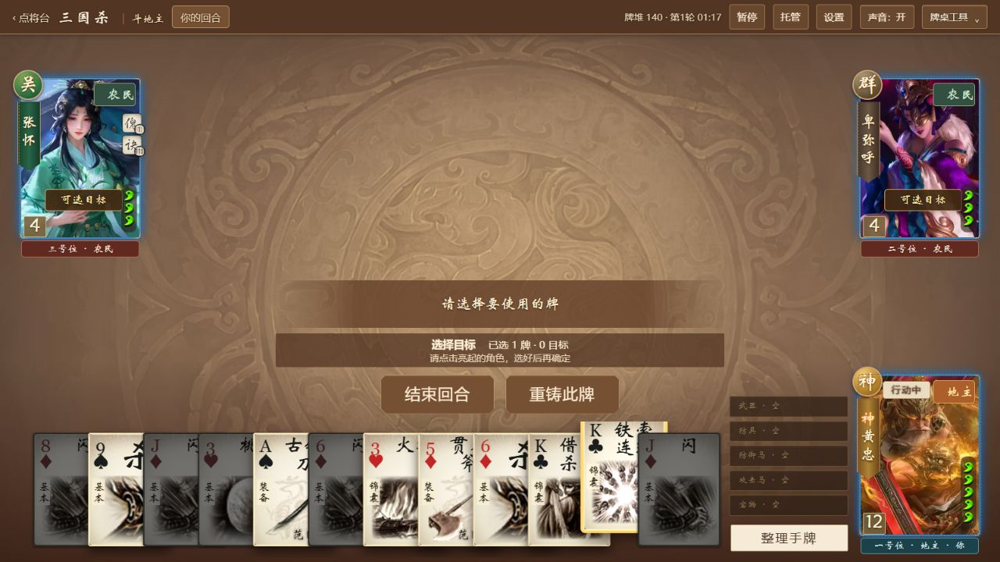
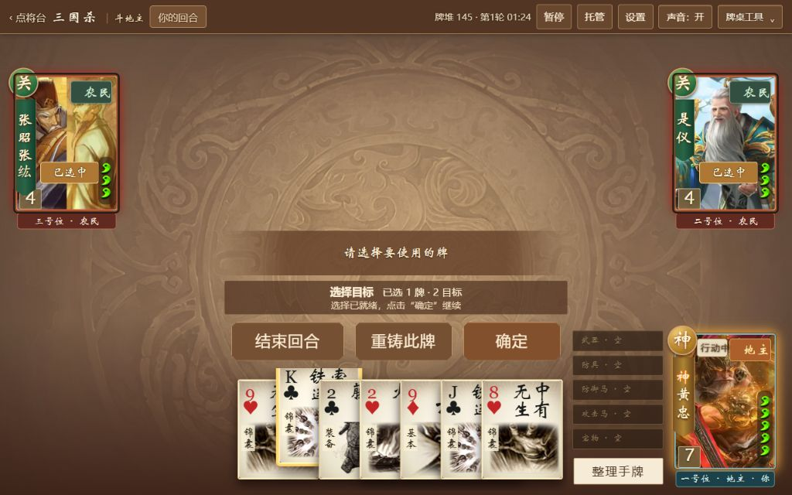
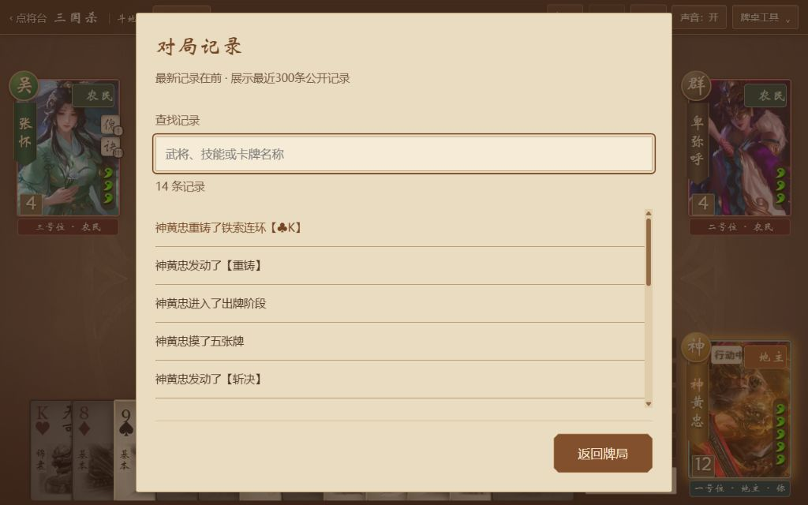

# 铁索连环选牌后重铸

2026-10-05，按用户要求，把重铸入口放到选择铁索连环之后。出牌阶段选中一张手牌铁索，原生规则允许重铸时，确认区立即显示“重铸此牌”。点击后自动保留这张牌进入原生重铸选择，再手动确认才执行。正常选择一至两名角色使用铁索，以及原有先点“重铸”再选牌的流程继续保留。

## 实现边界

- 仅针对人类正常出牌阶段的单张实体手牌铁索，同时核对原生有效牌名、原生技能启用条件与 `_recasting.filterCard`。
- 使用原生 `ui.click.skill('_recasting')` 进入技能，再由原生 `ui.click.card` 选择同一张牌。原生检查若不再允许选择，则不强选。
- 不直接调用重铸、弃牌、摸牌或确认，不改规则、AI、音频时机、原生选择数组或合法牌类名。进入重铸时，原来的连环目标由原生技能入口清除。
- 响应、AI、转化牌、多牌费用、复杂或自定义选择不显示此入口。取消、换牌、事件变化和页面清理会移除入口；旧按钮回调重新核对当前事件和选牌。

## 验证

219 项 Node 回归通过，其中新增四项使用锁定源码中的重铸技能、技能点击、事件备份/恢复及确定/取消处理器。覆盖正常连环目标、手动确认、取消恢复、直接换牌、临时技能禁用、不可重铸、有效牌名变化、AI/响应/自定义/多牌排除、进入技能后的原生选择限制和清理。

桌面父会话通过原生开局换牌取得铁索，未注入牌局状态：

- 选牌与重铸：1280×720下选中梅花K铁索后出现入口；随后在1024×640下，键盘 Enter 可进入原生重铸，仍持有同一张选牌，原连环目标清空，手牌不提前消耗。取消选择并点原生“取消”回到正常出牌。再次进入并手动确认后，公开日志记录“神黄忠重铸了铁索连环【♣︎K】”；手牌由12张恢复为12张，铁索换成摸到的牌，牌堆140变139，无连环状态或报牌语音。
- 1024×640：结束回合、重铸此牌、确定均在同一行，顶部416px、底部466px；新按钮126×50px。仅缩小新按钮的水平内边距，避免新增第三个按钮换行遮挡提示。
- 正常使用梅花K铁索选中两名角色并确认：原生公开日志分别记录是仪、张昭张纮被连环，角色显示原生 `linked2` 与“连环”，报牌为 `card/male/tiesuo`。
- 同局原有“重铸”入口仍可进入并取消；再通过新入口重铸梅花J铁索，手牌维持6张、牌堆145变144，两名角色已有连环状态保留，入口清理完成。
- 换到其他牌或取消铁索选择时入口立即消失。控制台无错误；测试标签关闭，用户原有页面未刷新。

Node 22/pnpm 生产构建通过；适配层 JS 语法及 CSS 解析通过。上游源码、画像、音频素材与旧未完成验收状态不变。

