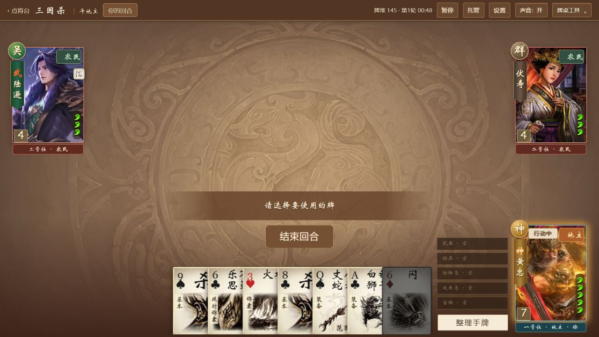
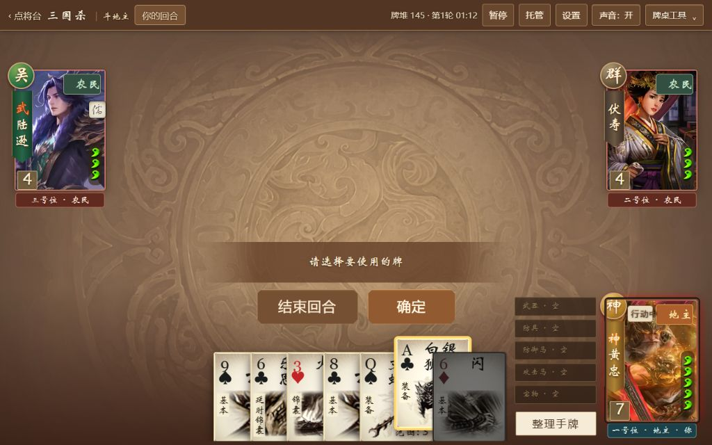

# SGS 暖棕古典 UI 验收

2026-10-05。开发分支 `codex/sgs-warm-client-ui`，基线 `ff41fc5`。本轮七项故事均完成桌面父会话浏览器验收，逐项本地提交；未推送或发布。

## 故事结果

| 故事 | 结果与证据 | 本地提交 |
| --- | --- | --- |
| WUI-01 主题基础 | 暖棕龙纹、木色切角按钮、浅纸色阅读面板；普通上游入口不加载SGS样式 | `a8b048c` |
| WUI-02 画像 | 2563个版本映射至2491张192×256 WebP，15.84 MiB，无缺图、失败或旧尺寸回退 | `238d80c` |
| WUI-03 顶栏与操作区 | 桌面44px单层顶栏；工具菜单收纳说明、记录、帮助、报告和重开；操作状态靠近确认区 | `fe0f227` |
| WUI-04 牌桌构图 | 四档桌面、三人/2v2/多人席位、居中手牌、装备与队友手牌；修复缩放触发的重排循环 | `b694663` |
| WUI-05 大厅 | 三栏纸面与固定出战；1280×720显示完整两排；修复载入时覆盖新玩法选择的竞态 | `a74e88a` |
| WUI-06 弹窗 | 设置、技能、评分、战绩、日志、报告、异常及结算统一；长内容独立滚动；原生介绍正常字号与焦点恢复 | `a84fd68` |
| WUI-07 综合验收 | 成品构建、回归、预算、对比度、多尺寸与真实对局复核；最终地主设置栏和窄屏长出战文案修整 | 本文件所在提交 |

## 环境与自动检查

- Windows；Node 22.12.0、pnpm 10.11.0；Python 3.10与Pillow 10.4仅用于画像维护。
- 本地预览仅监听 `127.0.0.1:8083`；未操作用户8081服务。所有构建子进程使用隐藏窗口。
- `node --test --test-reporter=dot tests/sgs/*.test.mjs`：214项通过。
- `python -m unittest discover -s tests/sgs -p test_portrait_builder.py`：3项通过。
- 所有SGS JS/MJS通过语法检查，所有SGS CSS通过PostCSS解析。
- `node scripts/sgs/build.mjs`：最终Node22/pnpm生产构建成功。构建仅有既有上游未使用导入提示。
- 生产目录与源码的2781个SGS文件逐一字节匹配。隔离异常夹具未进入生产目录。
- 锁定上游源码、LICENSE、卡牌画面素材及音频文件无本轮改动。普通入口 `/index.html` 显示原生模式选择页，SGS样式和界面节点均为零。

## 画像完整性

| 项目 | 结果 |
| --- | --- |
| 映射版本 / 去重文件 | 2563 / 2491 |
| 实际解码尺寸 | 全部192×256 |
| 最大单图 | 8190 bytes，小于8192 bytes预算 |
| 总量 | 16,607,254 bytes，约15.8379 MiB，小于20 MiB预算 |
| 缺失 / 构建失败 / 回退旧图 | 0 / 0 / 0 |
| 离线复建清单SHA256 | `31caff840e056cc6f1b9c7d510065b9fef8f0720b5dc450b3d511eb48e7af305` |

逐项保留原ID、`characterKey`、来源类别、来源URL/页面、别名与剪影说明；新增原图尺寸及SHA256。图片从已有归属原图重制，同源去重；未放大旧缩略图。完整解码、哈希与预算校验后才替换清单、清理旧文件。生产目录不保留两套头像，不在游玩时请求远程画像。

## 浏览器与真实对局

均通过真实界面操作；没有注入手牌、事件、身份或胜负状态。

| 范围 | 检查 |
| --- | --- |
| 1920×1080、1366×768、1280×720、1024×640 | 真实2v2开局、44px顶栏、头像/手牌/装备、队友手牌和确认区；成品截图均记录实际CSS视口 |
| 斗地主·地主 | 两次连续换牌、四张起手牌、地主准备阶段与摸牌时机；12张手牌；斩决选项、手选杀与目标、裂穹提示、火攻展示响应及原生六张弃牌 |
| 斗地主·农民 | 原生农民身份与队友手牌；杀响应南蛮、无合法牌时取消响应；斩决与手动选牌/目标 |
| 2v2 | 无懈与南蛮响应、强制弃牌、复杂选择；本轮六场自然结算，均写入独立战绩 |
| 八人身份 | 开局、斩决、顺手牵羊合法目标、弃牌、无闪时取消响应；第8轮自然结算，局时10:18 |
| 五人身份 | 席位布局、孙权主动技能按钮、制衡连续选两张代价牌，保持零目标且手动确认 |
| 六人与七人身份 | 1024×640真实开局布局；七人使用既有公开启动参数，未增加大厅入口或改写原生状态 |
| 390px大厅与弹窗 | 无横向页面溢出；出战按钮162×50；设置、评分、战绩详情、长技能、原生介绍、日志、报告、异常及结算可读可操作 |

六场2v2战绩局时为09:26、02:12、01:28、01:31、03:06、02:22。时间含开局截图、人工选择和阅读等待，不作为纯AI性能计时。部分回合由人手操作，随后使用原生托管完成；胜负没有替换或伪造。

### 连续性与暂停

- 选中一张响应杀后，20次往返设置、帮助、公开记录、报告和原生卡牌说明，仍保留同一张选牌，零额外目标；最后手动确认才提交响应。
- WUI-03另验证了一张装备与一个原生目标同时保留，经过设置、日志、帮助、报告及取消重开后不丢失。
- 设置打开时局时保持01:27；关闭嵌套设置后，既有暂停仍在，必须手动继续。
- 菜单内层Escape先收起内层，再收起工具菜单；原生介绍关闭后焦点回到可见工具入口。日志带搜索词时Escape正确关闭，IME保护由实际处理器回归测试覆盖。
- 大厅选择保留71.2px列表滚动与卡片焦点，改变窗口宽度后仍保留相应卡片与选将；组合筛选可逐项移除，排序、收藏和最近使用没有替换出战配置。
- 原生介绍保留原节点、内容、关闭回调和暂停行为；采用手动顶层显示，避免窄屏原生牌桌缩放影响文字。390px下内容宽326px、滚动宽326px，无横向溢出。
- 390×520结算中，内容区188px显示232px内容，三个底部按钮均高50px且底边不超过483.2px。

### 发现并修复

1. 原有ResizeObserver回调直接执行原生手牌重排，在地主牌桌1920→1024缩放时可触发循环通知并进入异常保护。改为下一帧合并执行，切换容器和退出时取消待执行工作；先获得失败回归，再验证修复。未屏蔽全局错误。
2. 名册异步加载完成后恢复旧设置，会覆盖加载期间刚选的玩法/人数/身份。设置恢复移到开始加载之前；延迟加载回归确认后续选择与真实启动参数一致。
3. 工具菜单中的原生介绍关闭后可能失去焦点。保留原生关闭工作，并只在未切到其他焦点/弹窗时恢复入口；退出后不再回调。
4. 复杂提示与下方状态区分开；短屏设置、报告与结算将正文滚动和底部操作分开。最终1280×720地主设置栏全部可见，390px长出战文案保持单行。

异常保护只在 `tests/sgs/browser-fixtures` 的隔离夹具中主动触发。重复错误合并为一条；Escape不恢复损坏牌局；下载失败仍保留异常暂停，可返回异常提示或请求重开。最终产物不包含这些夹具。

## 阅读对比度

使用最终共享颜色计算sRGB对比度；普通正文最小值4.67:1。不可用控件的淡化状态、原生阵营色与卡牌状态不作为正文配色。

| 文字 / 背景 | 对比度 |
| --- | --- |
| 深棕正文 / 纸面 | 8.78:1 |
| 次要正文 / 纸面 | 5.42:1 |
| 次要正文 / 浅纸面 | 6.20:1 |
| 次要正文 / 深纸面 | 4.67:1 |
| 米白字 / 深木色 | 9.89:1 |
| 米白字 / 主要按钮 | 5.97:1 |
| 次要米白字 / 木色控件 | 5.19:1 |

## 截图

- 改版前：[大厅](sgs-warm-ui-screenshots/before-lobby.jpg)、[牌桌](sgs-warm-ui-screenshots/before-table.jpg)。
- 成品牌桌：[1920](sgs-warm-ui-screenshots/final-table-1920.jpg)、[1366](sgs-warm-ui-screenshots/final-table-1366.jpg)、[1280](sgs-warm-ui-screenshots/final-table-1280.jpg)、[1024](sgs-warm-ui-screenshots/final-table-1024.jpg)。
- 成品大厅：[1280](sgs-warm-ui-screenshots/final-lobby-1280.jpg)、[390](sgs-warm-ui-screenshots/final-lobby-390.jpg)。
- 多人布局：[五人](sgs-warm-ui-screenshots/final-identity5-1024.jpg)、[六人](sgs-warm-ui-screenshots/final-identity6-1024.jpg)、[七人](sgs-warm-ui-screenshots/final-identity7-1024.jpg)、[八人](sgs-warm-ui-screenshots/wui04-identity8-1024.jpg)、[制衡](sgs-warm-ui-screenshots/final-active-skill-1024.jpg)。
- 阅读面板：[原生介绍](sgs-warm-ui-screenshots/wui06-native-intro-390.jpg)、[设置](sgs-warm-ui-screenshots/wui06-settings-390.jpg)、[日志](sgs-warm-ui-screenshots/wui06-log-390.jpg)、[战绩](sgs-warm-ui-screenshots/wui06-record-390.jpg)、[报告](sgs-warm-ui-screenshots/wui06-report-390.jpg)、[异常](sgs-warm-ui-screenshots/wui06-fault-390.jpg)、[结算](sgs-warm-ui-screenshots/wui06-result-390.jpg)。
- [普通上游入口](sgs-warm-ui-screenshots/final-upstream-entry.jpg)仍为原生页面。

## 保留的边界与旧未完事项

- `archive/2026-10-05-sgs-reliability` 的PRD和进度与基线一致；MAT-07=false。旧UX-09=false、US-006=false也未改变。本轮视觉验收不替代真实后台切换或官方全量规则验证。
- 没有改写规则、AI、原生合法性或胜负；没有新增音频/武将、生成美术、联网功能、存档恢复或主题选择器。
- 牌桌仍以桌面为目标；390px验证覆盖大厅和阅读/操作弹窗，不宣称手机竖屏完整牌桌适配。
- 已恢复神黄忠、地主、适中速度、声音开启、三路音量100%、后台暂停开启、减少动态关闭、隐藏旧将开启、综合评分从高到低。测试产生的真实战绩和最近使用记录保留。
- 本轮只保留本地开发历史；没有推送GitHub。

## 2026-10-05：移除额外操作状态栏

按用户截图要求，删除“出牌 / 已选数量 / 操作说明”条的节点、刷新逻辑和样式。原生出牌与复杂选择提示下移50px填补空隙；确认按钮位置不变。工具菜单保留，问题报告直接读取已有的有界公开操作元数据，不再依赖已删除的DOM。

218项Node回归通过（移除了只针对已删提示条的1项旧测试）；相关JS/CSS检查、Node22/pnpm生产构建和5个修改文件的源码/构建字节比对通过。父会话在真实地主对局检查1280×720开局、斩决复杂选择和普通出牌，以及1024×640选牌、手动确认入口、问题报告打开/关闭。状态栏节点为0；报告关闭后仍选中同一牌和同一目标。1024下原生提示底部406px，按钮顶部416px，高度50px，无重叠。控制台无错误，测试标签已关闭，用户原有页面未刷新。

